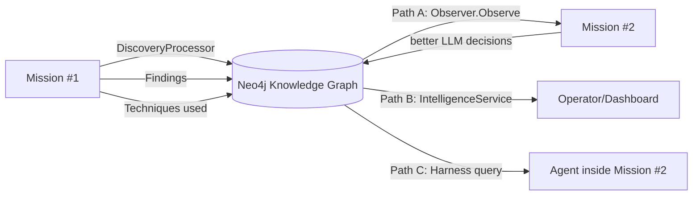

# CLAUDE.md — `core/gibson/`

Guidance for Claude Code working inside the Gibson daemon. Keep this file in sync with the code; it is the first thing the agent reads before editing this module.

## Project Overview

Gibson is the Kubernetes-native AI-agent orchestration **daemon** — a single Go 1.25 binary that exposes gRPC (`:50002`), runs mission DAGs, brokers multi-provider LLM calls, manages a Redis-backed component registry (agents/tools/plugins), and persists discoveries into a Neo4j knowledge graph. All components connect **into** this daemon; agents never touch Redis / Neo4j / LLM providers directly.

## Build & Test

```bash
make bin                    # bin/gibson (CGO_ENABLED=0, ldflags inject Version/GitCommit/BuildTime)
make test / test-race       # unit / race
make test-coverage          # enforces 90% via scripts/check-coverage.sh
make lint                   # golangci-lint
make check                  # fmt + vet + lint + test-race (pre-commit gate)
make proto / proto-clean    # regenerate local daemon proto via Buf
make check-authz [INTEGRATION=1]   # authz tests, +Docker for FGA testcontainers
go test -v -run TestName ./internal/path/...
```

Test file conventions: `*_test.go` (unit), `*_integration_test.go` (testcontainers for Redis / Neo4j / FGA), `*_e2e_test.go`. `testify/assert`. Mocks live beside the code they mock.

### Build-tag–gated tests

Some tests are gated behind Go build tags so they do not run during `make test`/`test-race` or `go test ./...`. They only execute when the tag is passed explicitly. CI runs them in dedicated jobs.

| Tag | Files | Why gated | Run with |
|---|---|---|---|
| `embedder_tests` | `internal/memory/embedder/{factory_test.go,native_test.go}` | Loads HuggingFace tokenizer model files from disk; can hang or download large artifacts on first run | `go test -tags=embedder_tests ./internal/memory/embedder/...` |

When adding a new test that has slow startup, network dependencies, or requires model files, prefer adding a build tag over flaky `t.Skip()` heuristics. Document the tag here.

## Directory Map (AI reference)

```
cmd/gibson/          Daemon entry point: minimal main.go (Mat Ryer pattern) + main_test.go. No cobra, no subcommands.
internal/
  daemon/            Lifecycle: daemon.go (New/Run/bootstrap), grpc.go (grpcSubsystem), health_subsystem.go, catalog_refresher_subsystem.go, extauthz_subsystem.go, eventbus*.go, event_stream_redis.go, credential_store.go, health_state.go, shutdown*.go
  daemon/api/        DaemonServer impl for BOTH DaemonService (proto in SDK) + DaemonAdminService (proto local). server.go (~3000 LOC) + split handlers: server_{capabilitygrant,alerts,audit,chat,quota,user,prod_handlers}.go, findings_export.go, credentials.go
  daemon/api/gibson/daemon/admin/v1/   daemon_admin.proto — the ONLY proto file owned by this module
  orchestrator/      Mission DAG executor: act / think / observe / recall / reflect stages, decision logic, error recovery, embedding cache
  mission/           Mission definition registry + MissionService, Redis stores (definitions, runs, events), checkpoint codec/manager, controller state machine. Definitions are created via the `CreateMissionDefinition` RPC and referenced by ID on `CreateMission` / `RunMission`; no inline or file-based loading remains in the daemon (inline removal + installer purge shipped under spec `mission-api-only-cleanup`, 2026-04-18).
  missiondraft/      Redis-backed 30-day mission YAML drafts
  checkpoint/        Mission pause/resume: codec, retention, blob store (Redis + optional S3)
  harness/           AgentHarness interface + CallbackServer (HarnessCallbackService gRPC), HarnessFactory, OTel middleware, compliance middleware
  component/         Redis component registry (30s TTL), lifecycle, load balancer (RoundRobin/Random/LeastConnection), circuit breaker, gRPC pool + per-kind clients (agent/tool/plugin), PluginAccessStore, ToolAccessStore, AgentAccessStore, quota
  agent/             Agent descriptor introspection, stream manager
  tool/              Tool metadata, registry helpers
  plugin/            Plugin metadata, registry helpers
  identity/          HMAC-verification interceptor for Envoy-signed x-gibson-identity-* headers (TenantFromContext, ContextWithTenant). FGA authorization has moved to Envoy + ext_authz gateway.
  extauthz/          ext_authz gRPC client lifecycle — connects to the sidecar that enforces FGA upstream of the daemon.
  apikeys/           API key Redis store (hash + lookup for gsk_-prefixed keys); key validation is performed by the ext_authz service, not inline.
  capabilitygrant/   Capability Grant Protocol: mint agent JWTs, FGA capability grant bridge
  authz/             OpenFGA HTTP client wrapper, noopAuthorizer, envelope HMAC signer, model.fga (schema 1.1)
  llm/               Slot resolver, provider registry (Anthropic/OpenAI/Gemini/Ollama + Bedrock/Cloudflare/Cohere/HuggingFace/Llamafile/Mistral — 10 total after spec 25 removed ernie/local/maritaca/watsonx; see `providers/` + `docs/byok-providers.md`), rate limiter, pricing (with SelfHosted/Unknown flags), embedding provider + cache, JSON extractor, tool-use tracker, error recovery. Each provider exposes `CredentialSchema()` consumed by the `GetSupportedProviders` admin RPC so the dashboard renders forms dynamically.
  providerconfig/    Encrypted per-tenant provider credential store (spec 25). Wraps `crypto.AESGCMEncryptor` + `KeyProvider` + Redis. Single source of truth for LLM provider credentials — dashboard does NOT have its own credential store. CRUD + Resolve surface consumed by `DaemonAdminService.{List,Get,Create,Update,Delete,Test}Provider + Get/Set Default/FallbackChain + ExecuteLLM + StreamLLM` handlers in `internal/daemon/api/server_provider_config.go` and `server_provider_exec.go`.
  ratelimit/         Redis sliding-window tenant rate limiter (spec 25). Default limits: ExecuteLLM/StreamLLM=1000/min, TestProvider=10/min, configurable via `llm.rate_limits` in gibson.yaml.
  memory/            3-tier: working (in-process), mission (Redis), longterm (vector store); MemoryFactory, TracedMemoryManager, embedder/ (OpenAI/Ollama/local), token counting
  graphrag/          Neo4j GraphStore (+ traced), loader/ (persist DiscoveryResult protos), processor/ (DiscoveryProcessor handles tool proto field 100), intelligence/ (graph queries for agent context), schema/, query.go, graph_bootstrap.go
  neo4j/             Thin Neo4j client + schema migration runner
  finding/           Finding persistence, lifecycle, evidence tracking
  crypto/            AES-256-GCM + KeyProvider: k8s secret / Vault / AWS SM / Azure KV / GCP SM (factory)
  config/            Loader, schema, validation, env var substitution `${VAR:-default}`
  state/             Redis client wrapper, TenantScopedStore (tenant-prefixed keys)
  database/          Redis DAOs (TargetDAO, CredentialDAO, …)
  events/            In-process pub/sub: DefaultEventBus + event types used by mission/harness/plugin. The daemon-local EventBus (api.EventData gRPC delivery) lives in internal/daemon/eventbus.go pending circular-import resolution.
  observability/     slog logger, OTel stack (tracer/meter/logger providers), OTLP exporters, attributes helpers
  audit/             Audit writer, Loki client, Redis audit stream consumers
  impersonation/     Tenant impersonation token issuer (platform-operator only)
  onboarding/        Redis-backed tenant onboarding state
  guardrail/         Policy/compliance gates enforced inside the mission loop
  contextkeys/       Shared ctx keys (AgentRunID, ToolExecutionID, MissionRunID, AgentName, MissionID) — exists to break import cycles
  schema/            Shared mission / graphrag schema types (task, result, finding, target, endpoint)
  types/             Core domain types (Mission, Target, Agent, Task, Result, Finding)
  plan/              Mission planning helpers used by orchestrator
  prompt/            Prompt template management
  eval/              Agent/mission evaluation harness (lightly integrated)
  testing/           Test fixtures shared across packages
pkg/version/         Build-time version info (Version/GitCommit/BuildTime set via ldflags). Single source of truth — internal/version was deleted; all callers import this package.
sdk/                 Shared graphrag + manifest helpers used by this daemon and SDK tests
models/huggingface/  Embedding model metadata
configs/             gibson.yaml template
scripts/             check-coverage.sh etc.
tests/               integration + e2e tests (cross-package)
```

## Daemon Startup Pipeline (`internal/daemon/daemon.go` → `Run(ctx) error`)

`Run(ctx)` is the sole lifecycle entry point. It runs a sequential `bootstrap(ctx)` then launches subsystems concurrently via `errgroup.WithContext`. Signal handling lives in `cmd/gibson/main.go` (stdlib `signal.NotifyContext`); `Run` simply returns when its context is cancelled.

**Phase 1 — `bootstrap(ctx)` (sequential, fail-fast):**

1. **State client (Redis)** — REQUIRED. Retry loop; initialises Redis event stream.
2. **Authorizer** — OpenFGA client or noop (see Authz table below).
3. **Dashboard Postgres pool** — optional; non-fatal if missing (used for audit_log reads, tenant state).
4. **Component registry + lifecycle** — Redis, 30 s TTL heartbeat. Registry adapter wires discovery callbacks.
5. **Mission stack** — `MissionService`, `MissionStore`, `MissionRunStore`, `EventStore`, `CheckpointManager`.
6. **Quota manager** — per-tenant caps (missions / agents / findings).
7. **Infrastructure bundle** — DAG executor, finding store, LLM registry, memory factory, harness factory, OTel stack, GraphRAG store + discovery processor.
8. **Credential store** — KeyProvider + CredentialDAO (optional; enabled if `security.key_provider` set).
9. **Access stores** — Tool / Agent / Plugin opt-in (Redis).

**Phase 2 — `errgroup` serve loop (concurrent subsystems):**

Each subsystem exposes `Serve(ctx) error` and is launched via `eg.Go`. Cancelling `ctx` cascades to all subsystems concurrently. Any subsystem returning a non-nil error cancels the group.

- **gRPC server** (`grpcSubsystem`) — identity interceptor (HMAC-signed Envoy headers, skip if secret unavailable), SPIFFE mTLS (optional), registers DaemonService + DaemonAdminService + ComponentService + HarnessCallbackService + IntelligenceService (when GraphRAG live).
- **Callback manager** — HarnessCallbackService on `:50001`.
- **Health server** (`healthSubsystem`) on `:8080` — `/healthz` liveness, `/readyz` readiness.
- **Catalog refresher** (`catalogRefresherSubsystem`) — 60 s discovery fanout.
- **ext_authz client** (`extauthzSubsystem`) — lifecycle owner for the Envoy ext_authz gRPC connection.
- **Event bus** — in-process pub/sub + per-tenant Redis Streams bridge.

**Phase 3 — shutdown coordinator (5-phase, runs after errgroup returns):**

PreShutdown → Stop new work → Checkpoint (save active missions to Redis via `DaemonMissionCheckpointer`) → Drain (wait for in-flight) → Terminate.

## gRPC Surface

Two Gibson-owned services plus two re-exported SDK services plus the harness callback service. **Public** = on the main daemon port; **Admin** = same port but FGA-gated to platform-operator role.

| Service | Proto source | Purpose |
|---|---|---|
| `gibson.daemon.v1.DaemonService` | **SDK** (`sdk/api/gen/gibson/daemon/v1`, alias `daemonpb`) | Public mission / component / agent control plane. RPCs: Connect, Ping, Status, RunMission (stream), StopMission, Pause/ResumeMission, List/Get Mission{History,Checkpoints}, ListAgents, GetAgentStatus, ListTools, ListPlugins, QueryPlugin, Subscribe (stream), Start/StopComponent, CreateMissionDefinition, CreateMission, ListMissionDefinitions, GetMissionDefinition, GetComponentLogs (stream), GetMyPermissions. `CreateMission` / `RunMission` are reference-only (mission-definition-id + target-id); no inline configs, no YAML payloads, no file paths. |
| `gibson.daemon.admin.v1.DaemonAdminService` | **Local** (`internal/daemon/api/gibson/daemon/admin/v1/daemon_admin.proto`) | Privileged ops: Shutdown, ImpersonateTenant, {Get,Set,Delete}TenantLangfuseCredentials, {Get,Update}OnboardingState, {Create,List,Revoke}APIKey, ListAuditEvents, capability-grant (RegisterCapabilityGrant, ExecuteAgentCapability, GetCapabilityGrantStatus, RevokeCapabilityGrant, ListCapabilityGrantAgents, ListAgentCapabilities, CreateHostRegistrationToken, ListComponentGrants, BatchGrantComponentAccessV2, ListAuditLog), tenant quota/sessions/alerts/conversations, findings export, mission drafts, user-profile RPCs (ResetPassword / RevokeUserSessions / SuspendMember — some stubbed, see Implementation Status below). |
| `gibson.component.v1.ComponentService` | SDK | `RegisterComponent`, `PollWork` (stream), `SubmitResult`, heartbeat. Called by every agent / tool / plugin. |
| `gibson.harness.v1.HarnessCallbackService` | SDK | Agent → daemon callbacks: `ExecuteLLM`, `SubmitFinding`, `Store/GetMemory`, `ExecuteTool`, `QueryPlugin`, `GetCredential`. Runs on `:50001` via `harness.CallbackManager`. |
| `intelligence.v1.IntelligenceService` | SDK | Cross-mission analytics RPCs (`GetRecurringVulnerabilities`, `GetRemediationMetrics`, `GetAssetRiskScore`, `GetAttackPatterns`, `GetSimilarTargets`). Server-side adapter at `internal/graphrag/intelligence/grpc.go` wraps `intelligence.Service`. Skipped when GraphRAG/Neo4j unavailable. Wired under spec `productionize-graph-intelligence`. |

## Mission, Orchestrator, Intelligence — How It All Fits

Gibson has four conceptual layers in the operational stack. They are easy to confuse — especially since the Attack* terminology shows up in three of them with three different meanings. Read this section before editing any of these areas.

**The four layers:**

- **Mission DAG** (`internal/mission/`, `internal/graphrag/schema/mission.go`) — the operational unit. A mission is a parameterised mission definition targeting a specific system, declaring agents/nodes and their dependencies. Today's canonical orchestration shape; replaces the deleted single-attack runner (see historical note below).
- **Orchestrator** (`internal/orchestrator/`) — the DAG executor that runs a mission. Decision loop is Observe → Think → Act → (optional Recall / Reflect). The Observer collects state into an `ObservationState`; the Thinker calls the LLM with the formatted prompt to choose next nodes; the Actor dispatches via the harness.
- **Intelligence layer** (`internal/graphrag/intelligence/` + `internal/orchestrator/graph_intelligence.go`) — cross-mission analytics queries on the knowledge graph. Five aggregate queries (`GetRecurringVulnerabilities`, `GetRemediationMetrics`, `GetAssetRiskScore`, `GetAttackPatterns`, `GetSimilarTargets`) plus four per-target queries (`GetTargetHistory`, `GetPriorFindings`, `GetKnownEntities`, `GetSuccessfulPatterns`). All Cypher; all read-only; cached + circuit-breaker protected.
- **Knowledge graph** (Neo4j, accessed via `internal/graphrag/`) — storage for all mission outcomes. Every mission's `DiscoveryProcessor` writes Mission, Technique, Finding, Host, Port, Service, Endpoint nodes plus relationships during execution. Over time Neo4j accumulates the data the intelligence layer queries.

**The cross-mission learning loop:**



**Three intelligence access paths** — same data, different consumer:

| Path | Consumer | Flow | Use case |
|---|---|---|---|
| **A** Decision-time prompt enrichment | `Observer.Observe()` during each mission step | `Observer → GraphQueries → Neo4jGraphQueries → Neo4j` | Automatic; populates `ObservationState.GraphContext` and renders a `=== GRAPH INTELLIGENCE (Prior Knowledge) ===` section in the LLM prompt. No agent action required. |
| **B** Cross-mission analytics RPC | Operator / dashboard / agent calling `intelligencepb.IntelligenceServiceClient` (typically via SDK `PlatformHarness`) | `Caller → SDK platformIntelligenceProxy → IntelligenceService gRPC → daemon → intelligence.Service → Neo4j` | Strategic queries: "what vulnerabilities recur across our portfolio?", "what are the top 10 highest-risk assets?", "find targets similar to this one." |
| **C** Per-finding agent query | Agent calling `harness.FindSimilarAttacks` / `GetAttackChains` / `FindSimilarFindings` / `GetRelatedFindings` mid-reasoning | `Agent → harness.implementation → graphRAGQueryBridge → HarnessCallbackService gRPC → daemon → graphrag store → Neo4j` | Tactical queries inside an agent's loop: "have we seen something like this finding before?", "what attack chains start from this technique?" |

All three paths were productionized under spec `productionize-graph-intelligence`. Before that spec, Path A's Observer wiring was missing (`WithGraphQueries` didn't exist), Path B's daemon-side gRPC server was unregistered (every SDK proxy call hit the `Unimplemented`-degradation fallback), and Path C was wired but undiscovered (no in-tree agent invoked it).

**Historical note — old single-attack runner vs. the surviving `Attack*` types:**

The spec `remove-attack-payload-subsystem` (commits a1596f1, 8da4897, fc51b46, fc8f442, f957171) deleted `internal/attack/` (the ad-hoc one-off attack runner) and `internal/payload/` (parameterised attack templates). Those were the **old model** that missions superseded — they ran a single attack against a single target without any DAG / orchestration / cross-mission learning. The `gibson.daemon.v1.AttackEvent` proto message was removed from the SDK in lockstep (field 6 reserved in `Event` and `SubscribeResponse`).

The surviving `Attack*` types live in **completely different protos** and describe **graph-derived attack-pattern analytics**, not running attacks:

- `intelligence.v1.AttackPattern`, `intelligence.v1.TechniqueInChain` — patterns identified by `GetAttackPatterns` analyzing successful technique sequences across completed missions.
- `gibson.harness.v1.AttackPattern`, `gibson.harness.v1.AttackChain`, `gibson.harness.v1.AttackStep` — per-finding query responses returned by `FindSimilarAttacks` / `GetAttackChains` to inquiring agents.
- `gibson.types.v1.MitreMapping.mitre_attack` field on findings — MITRE ATT&CK technique categorisation metadata.
- `taxonomy/core.yaml` `ATTACK TYPES` section — MITRE ATT&CK technique enum used for finding categorisation.

The naming overlap is unfortunate but the concepts are unrelated. Do not conflate them. When in doubt: anything in `internal/attack/` would have been the runner (deleted); anything with `Attack` in the name living in `intelligence.v1`, `gibson.harness.v1`, or the MITRE taxonomy is graph intelligence and stays.

**Implementation status within DaemonAdminService** — core admin RPCs (authz, audit, API keys, impersonation, Langfuse creds, capability-grant, onboarding) are fully wired. The `prod-unimplemented-apis` / `prod-feature-wiring` spec tracked stubs are in `server_prod_handlers.go` (ResetPassword, RevokeUserSessions, SuspendMember, Get/UpdateUserProfile, ExportFindings, SaveMissionDraft/ListMissionDrafts, GetUserSessions, Alerts, Conversations) — they return valid empty/stub responses and are enforced by `TestNewRPCsNotUnimplemented` (`server_integration_test.go`) to never emit `codes.Unimplemented`.

## Feature Catalog — what's wired and where

| Feature | Primary pkg | Wired-in status | Key deps |
|---|---|---|---|
| Mission orchestration (DAG act/think/observe/recall/reflect) | `internal/orchestrator/` + `internal/mission/` | ✅ Active | Redis, LLM, harness, GraphRAG |
| Mission pause/resume | `internal/mission/checkpoint*.go` + `internal/checkpoint/` | ✅ Active | Redis + optional S3 blob store |
| Component registry + load balancing | `internal/component/` | ✅ Active | Redis, component gRPC |
| Agent harness (unified capability API) | `internal/harness/` | ✅ Active | LLM registry, memory, finding store, plugin access |
| 3-tier memory | `internal/memory/` | ✅ Active | Redis + vector store + embedder |
| LLM multi-provider slot resolution | `internal/llm/` | ✅ Active | provider API keys |
| GraphRAG ingest (proto field 100 → Neo4j) | `internal/graphrag/` | ✅ Active | Neo4j |
| GraphRAG intelligence queries (per-finding agent recall — Path C) | `internal/graphrag/intelligence/` + `internal/harness/graphrag_query_bridge.go` | ✅ Active | Neo4j |
| Orchestrator graph intelligence (decision-prompt enrichment — Path A) | `internal/orchestrator/graph_intelligence.go` + `Observer.observeGraphContext` | ✅ Active (wired under `productionize-graph-intelligence`) | Neo4j |
| IntelligenceService gRPC (cross-mission analytics — Path B) | `internal/graphrag/intelligence/grpc.go` | ✅ Active (registered under `productionize-graph-intelligence`) | Neo4j |
| Identity HMAC verification (Envoy-signed headers) | `internal/identity/` | ✅ Active | HMAC secret via `internal/extauthz` |
| API key store | `internal/apikeys/` | ✅ Active (validation in ext_authz sidecar; store here) | Redis |
| OpenFGA authZ (upstream, via ext_authz) | `internal/extauthz/` + `internal/authz/` | ✅ Active — FGA enforced by Envoy/ext_authz; daemon trusts signed identity headers | ext_authz sidecar → FGA HTTP `gibson-fga:8080` |
| Capability Grant Protocol (JWT mint + FGA bridge) | `internal/capabilitygrant/` | ✅ Active (dispatch of `ExecuteAgentCapability` is a thin stub — FGA check works, execution forwarding is minimal) | FGA |
| Plugin config encryption (AES-256-GCM) | `internal/crypto/` | ✅ Active if `security.key_provider` set | k8s/Vault/AWS/Azure/GCP |
| Event streaming (`Subscribe` RPC) | `internal/daemon/eventbus*.go` + `internal/events/` | ✅ Active | Redis Streams (optional; in-process fallback) |
| Audit logging | `internal/audit/` | ✅ Wired, low usage | Redis stream + Loki + Postgres |
| Health probes | `internal/daemon/health_state.go` + SDK `healthhttp` | ✅ Active | FGA (for `/readyz` if authz on) |
| Observability (logs / traces / metrics) | `internal/observability/` | ✅ Active | OTLP collector (optional) |
| Tenant impersonation | `internal/impersonation/` | ✅ Active, minimal callers | FGA role check |
| Onboarding state | `internal/onboarding/` | ✅ Active, minimal callers | Redis |
| Guardrails | `internal/guardrail/` | ✅ Active inside mission loop | — |
| Sandboxed tool execution (Setec microVM dispatch) | `internal/harness/sandboxed/` + `internal/daemon/sandboxed_setec_adapter.go` (build tag `setec_integration`) | ⚠️ Code in place; enable by building with `-tags=setec_integration` and wiring config per `opensource/setec/development/k3s/README.md` | Setec gRPC frontend (private repo at time of writing) |
| Eval harness | `internal/eval/` | ⚠️ Lightly integrated; only orchestrator touches it | — |

## Authorization (OpenFGA) — Startup Behaviour Matrix

| `authz.enabled` | FGA reachable | `require_ready` | Result |
|---|---|---|---|
| false | — | — | noop authorizer, INFO log |
| true | yes | — | FGA authorizer, INFO log |
| true | no | true | daemon fails to start (production) |
| true | no | false | noop authorizer, WARN log (dev) |

- FGA endpoint is **HTTP** at `gibson-fga:8080` (not gRPC 8081). FGA enforcement is performed by the Envoy + ext_authz sidecar, not inline in the daemon.
- The daemon still holds `internal/authz/` for the OpenFGA HTTP client wrapper and noop authorizer (used for admin-RPC capability checks). The old inline FGA interceptor has been removed.
- `internal/authz/model.fga` is schema 1.1 with types `user`, `tenant`, `component`, `system_tenant`. Provisioned by the `gibson-fga-init` k8s Job on helm install/upgrade.
- Store/model IDs resolved in order: config file → ConfigMap `gibson/gibson-fga-config` → env `GIBSON_AUTHZ_FGA_STORE_ID` / `..._MODEL_ID`.

## Identity / SPIFFE — In-cluster Transport

Daemon SPIFFE mTLS stays **ON in every overlay** including Kind dev. There is no debugging shortcut to disable it. Memorialised by:

- **Memory** `feedback_spiffe_mtls_required.md` — agent context that this is forbidden.
- **Chart guard** `gibson.validateSpiffeRequired` in `enterprise/deploy/helm/gibson/templates/_helpers.tpl` — `helm template/install/upgrade` fails if `gibson.auth.spiffe` is null/empty in any overlay.
- **Chart guard** `gibson.validateEnvoySdsWired` — `helm template` fails if Envoy is enabled and `gibson.auth.spiffe` is populated but `files/envoy/envoy.yaml` lacks the SDS `UpstreamTlsContext` on the `gibson_daemon_grpc` cluster.
- **CI guard** `.github/workflows/spiffe-guard.yml` — blocks PR merge on the same regressions.

Three layers of defense; cost of disabling daemon SPIFFE = cost of writing spec `in-cluster-mtls-restoration` (non-trivial). Don't.

**Single canonical path: dashboard → Envoy → daemon, JWT-SVID auth.** All dashboard-originated daemon RPCs (admin and non-admin alike) flow through Envoy at `https://api.<domain>:30443` with `Authorization: Bearer <SPIFFE JWT-SVID>` (audience `spiffe://gibson.io/platform/daemon`). Envoy validates the JWT-SVID via its `spiffe` provider, ext-authz mints HMAC-signed `x-gibson-identity-*` headers, and the daemon trusts those headers exclusively. The daemon's mTLS listener accepts ONLY connections from `spiffe://gibson.io/platform/envoy` (Envoy presents its own SPIRE-issued SVID via SDS). Direct dashboard → daemon paths are forbidden by `gibson.validateEnvoySdsWired` + the dashboard's `gibson-client.ts` is wired to refuse them post Phase 5 of `in-cluster-mtls-restoration`. See `docs/auth-flow.md` "In-cluster transport" for the full sequence diagram.

**Component identities** registered with SPIRE (entries in `gibson-spire-server`):
- `spiffe://gibson.io/platform/daemon` — gibson statefulset; serves mTLS on `:50051`.
- `spiffe://gibson.io/platform/envoy` — gibson-envoy deployment; presents this SVID upstream to the daemon via SDS-resolved `UpstreamTlsContext`.
- `spiffe://gibson.io/platform/dashboard` — gibson-dashboard deployment; mints JWT-SVIDs for the audience above.
- `spiffe://gibson.io/platform/tenant-operator` — gibson-tenant-operator; same JWT-SVID minting pattern for admin RPCs.
- `spiffe://gibson.io/platform/spiffe-jwks` — sidecar that translates the SPIRE JWT bundle into a JWKS HTTP endpoint Envoy and Auth.js can consume.

The trust domain `gibson.io` is **legacy** — see memory `project_gibson_ownership.md`. Renaming to `zero-day.ai` is out of scope; track in a future spec.

## Multi-Tenancy Rules

- `_system` is the platform-tenant; hosts plugins available to every tenant.
- `ComponentService` reads tenant from auth metadata via `identity.TenantFromContext()`.
- Registry exposes `Discover`, `DiscoverAll`, `DiscoverTenantOnly`, `DiscoverSystemOnly` — pick deliberately; `DiscoverAll` leaks system components into tenant listings.
- **Tenant create/provision/deprovision is NOT in this daemon.** It moved to the external `gibson-tenant-operator`. Gibson is a read-consumer of tenant state. Do not add tenant lifecycle RPCs here.

## Proto / Generated Code

This module owns **exactly one** proto file:

- `internal/daemon/api/gibson/daemon/admin/v1/daemon_admin.proto` — package `gibson.daemon.admin.v1`, `go_package` points back into `internal/daemon/api`, so the generated `daemon_admin.pb.go` + `daemon_admin_grpc.pb.go` live alongside `server.go`.

Everything else (`gibson.daemon.v1`, `gibson.component.v1`, `gibson.harness.v1`, `gibson.agent.v1`, `gibson.tool.v1`, `gibson.plugin.v1`, `gibson.graphrag.v1`, `gibson.types.v1`, `gibson.common.v1`, `gibson.mission.v1`, `taxonomy.v1`, `intelligence.v1`) is **consumed** from the SDK (`github.com/zero-day-ai/sdk/api/gen/...`). Gibson imports those generated Go types — never hand-writes them, never duplicates the proto files here. The SDK has zero tool-specific knowledge per spec `decouple-sdk-from-tool-protos`; tool message types are resolved at runtime via `FileDescriptorSet` metadata flowing through `sdk/protoresolver`, and tool-specific recovery hints are registered by `internal/harness/toolerr_defaults.go` here in gibson.

`make proto` runs `npx --prefix ../../enterprise/dashboard buf generate`, so the dashboard sibling checkout must exist. `buf lint` uses the STANDARD ruleset, no exceptions. When you add an admin RPC: regenerate Go here, then regenerate TypeScript in the dashboard repo.

## Dead / Legacy Code (verified 2026-04-15)

Pay attention to these when refactoring — they look load-bearing but generally aren't. Confirm with grep before deleting; some are kept intentionally.

| Path | Reality | Recommendation |
|---|---|---|
| `internal/util/` | Only `paths.go` + test | Keep; used by config loader |
| Stub RPCs in `server_prod_handlers.go` (ResetPassword, RevokeUserSessions, SuspendMember, Get/UpdateUserProfile, ExportFindings, mission drafts, GetUserSessions, Alerts, Conversations) | Intentional — tracked under `prod-unimplemented-apis` and `prod-feature-wiring` specs; test-enforced to return non-Unimplemented | Implement per-spec; don't delete. |

## Tracked Security Advisories (awaiting upstream fix)

Dependabot advisories against this module that have no patched release available yet. Revisit when the upstream target ships.

| Advisory | Severity | Current pin | Target pin | Trigger |
|---|---|---|---|---|
| [GHSA-x744-4wpc-v9h2](https://github.com/advisories/GHSA-x744-4wpc-v9h2) — Moby AuthZ plugin bypass via oversized request bodies | HIGH | `github.com/docker/docker v28.5.2+incompatible` (indirect) | `v29.3.1+incompatible` (unreleased as of 2026-04-15) | `go get github.com/docker/docker@latest` once 29.3.1 ships |
| [GHSA-pxq6-2prw-chj9](https://github.com/advisories/GHSA-pxq6-2prw-chj9) — Moby plugin privilege off-by-one | MEDIUM | `github.com/docker/docker v28.5.2+incompatible` (indirect) | `v29.3.1+incompatible` | same as above |

## Critical Rules

- **GitHub-only imports.** No `replace` directives to local paths, no `file://` refs. Local replace causes proto descriptor mismatches and daemon panics. Use `go work` if you must iterate on the SDK locally.
- **No tool / plugin / agent modules in `go.mod`.** Gibson depends on the SDK only. Tool proto types are resolved dynamically at runtime via `sdk/protoresolver` from FileDescriptorSet metadata sent by the tool itself — gibson does NOT compile-time-import any tool's wire bindings (the old SDK `toolspb` package was deleted under spec `decouple-sdk-from-tool-protos`).
- **Proto field 100** in every tool response is reserved for `gibson.graphrag.v1.DiscoveryResult`. Do not repurpose it.
- **`component.yaml`** defines agent/tool/plugin metadata for registry discovery — loadable without booting the binary.
- **Never hand-write proto message types or gRPC stubs.** Always `buf generate`.
- **GitOps for Kubernetes.** No `kubectl patch`, no live ConfigMap edits, no ad-hoc mutation — go through Helm values / manifest commits unless the session is explicitly authorised for a one-off.
- **Do not add tenant lifecycle RPCs here.** Those belong to `gibson-tenant-operator`.
- **Structured logging with `log/slog`** + context propagation; no `fmt.Println` in daemon paths.
- **`CGO_ENABLED=0`** for all builds; Go 1.25.

## Configuration (`configs/gibson.yaml` or `~/.gibson/config.yaml`)

Key sections: `core` (home/data/cache dirs, parallel_limit), `security` (encryption algo, `key_provider` = k8s/vault/aws/azure/gcp), `llm` (default_provider + providers), `memory` (embedder + vector store), `logging`, `tracing`, `metrics`, `registry`, `callback`, `daemon` (grpc addr), `health`, `redis` (REQUIRED), `plugins`, `auth` (HMAC secret for Envoy-signed identity headers; Zitadel/external IdP config consumed upstream by the gateway, not inline by the daemon), `authz` (FGA store/model IDs, `require_ready`), `checkpoint` (redis or s3 blob backend), `observability` / `otel_observability`, `dashboard_postgres` (optional; non-fatal if missing). Env var substitution: `${VAR:-default}`.

## Infrastructure Dependencies

- **Redis** — required. state, queues, mission memory, daemon registration, plugin/credential storage, component registry, event streams, audit stream.
- **Neo4j 5.x** — GraphRAG knowledge graph (only required if GraphRAG is exercised).
- **OpenFGA** — authZ (HTTP `gibson-fga:8080`); required when `authz.enabled=true && authz.require_ready=true`.
- **PostgreSQL** (dashboard DB) — optional; audit_log reads, tenant state. Non-fatal if missing.
- **ClickHouse** — only via Langfuse (not a direct dep).
- **SPIRE** — optional; workload identity for daemon-to-daemon mTLS.
- **OTLP collector** — optional; falls back to stdio logging.

Redis key patterns: `plugin-access:tenant:name`, `plugin-config:tenant:name`, `plugin-schema:name`, `mission:run:*`, `component:registry:*`, `audit:stream:<tenant>`.

## Secrets & Pre-commit

Pre-commit runs gitleaks + large-file + private-key checks (`.pre-commit-config.yaml`, `.gitleaks.toml` at repo root). `.env.local`, `.env.production`, `.env.staging` are gitignored and path-blocked — use `.env.example`. Don't allow-list findings; fix the content.

## Spec Workflow

This module drives design via `.spec-workflow/` at the repo root (requirements / design / tasks). Active specs touching this daemon currently include the FGA authZ migration, `prod-unimplemented-apis`, `prod-feature-wiring`, capability-grant FGA integration, and auth refactor. Recently completed: `remove-attack-payload-subsystem` (deleted the ad-hoc one-off attack runner and payload templates that missions superseded), `productionize-graph-intelligence` (wired the orchestrator's `WithGraphQueries`, registered the `IntelligenceService` gRPC endpoint, and added the cross-mission learning data-flow documented above), `decouple-sdk-from-tool-protos` (deleted the SDK's `toolspb` package + tool-specific recovery defaults; gibson now hosts all tool-specific knowledge in `internal/harness/toolerr_defaults.go`), and `mission-api-only-cleanup` (renamed the `gibson.workflow.v1` proto package to `gibson.mission.v1`, removed all inline-target / inline-workflow / workflow-YAML / workflow-path payloads from `CreateMission` + `RunMission`, and purged the dead mission/component installer + dependency-resolver RPCs, handlers, CLI commands, and the 726-LOC `internal/mission/installer.go`). Completed specs are not retained as documents — shipped code and commit history are the source of truth.
