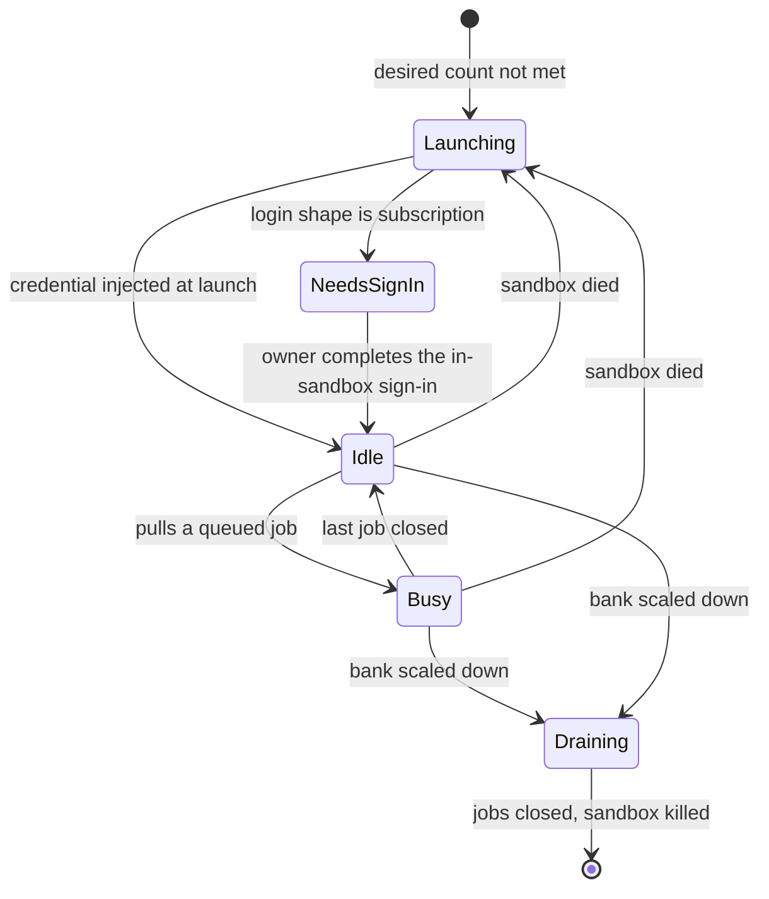
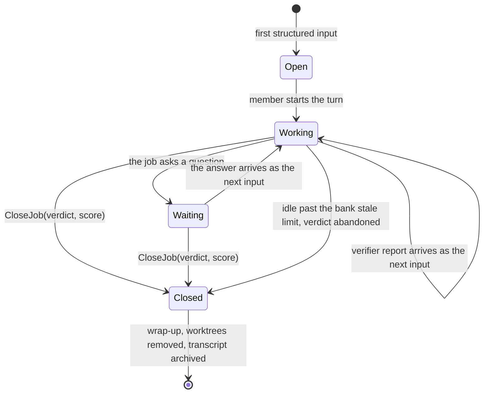
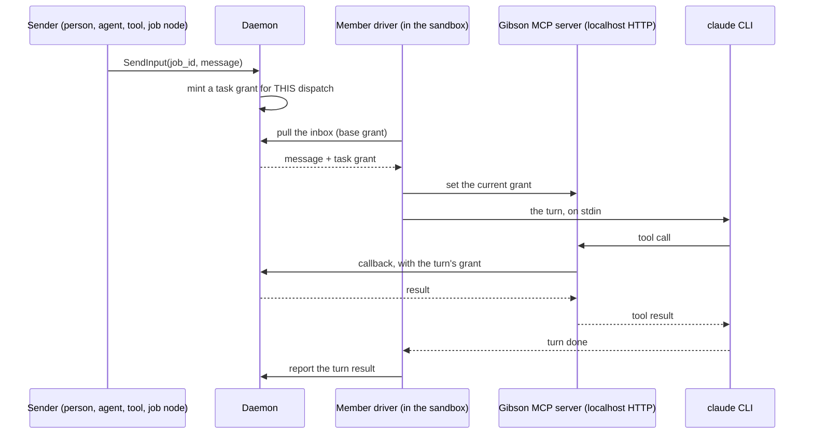
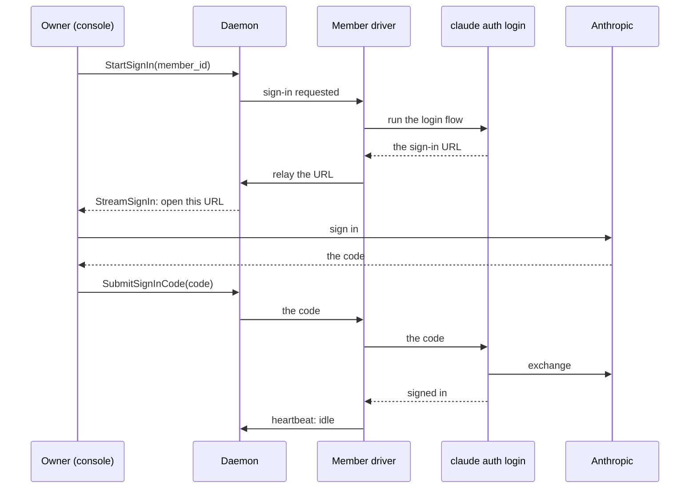
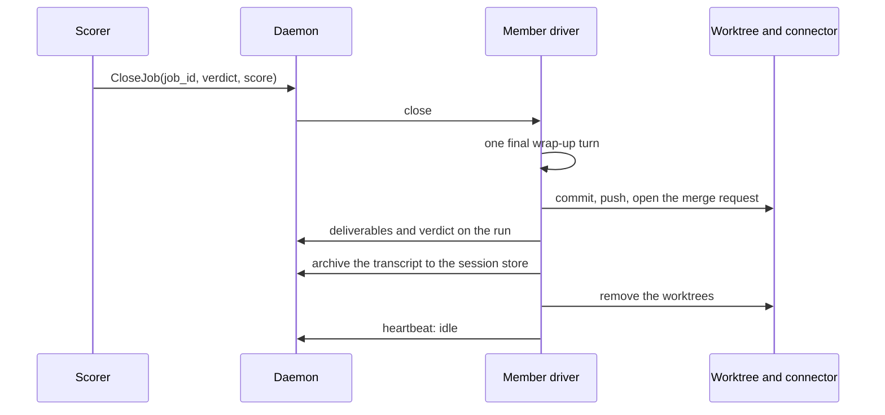

# Banks, jobs and the job node

A **bank** is a pool of always-on Claude Code instances the daemon keeps
running. A **member** is one instance in that pool. A **job** is one unit of
work a member holds, with its own conversation and its own worktrees.

The decisions behind this page are [ADR-0019](../adr/0019-banks-of-always-on-agents.md).
The terms are defined in [`CONTEXT.md`](../../CONTEXT.md), section
"Banks, members and jobs". This page shows how the parts move.

It amends [ADR-0016](../adr/0016-sandboxed-agent-dispatch.md), which says one
mission run takes one sandbox and the sandbox is torn down after. That still
holds for a one-shot dispatch. A member is the second shape: one sandbox that
serves many dispatches over its life.

## Why a member is not a one-shot run

| | One-shot dispatch | Bank member |
|---|---|---|
| Lifetime | One mission run | Until the bank scales down |
| Input after launch | None | Every job and every turn |
| Grant | One, for the whole run | One per turn, from that turn's dispatch |
| Teardown | setec's finished-TTL reaper | The reconciler, on scale-down |
| Login shape | API key or third-party provider | Any of the three, subscription included |

## Bank reconcile

The daemon holds the desired count. The reconciler makes the running count
match it.

A member is never finished on its own. The setec reaper leaves it alone, so
only a scale-down or a death ends it. A dead member's open jobs return to the
bank queue.

## Job state machine

A job is opened by the first structured input. It is closed by a scorer, never
by the worker.

Three principals may close a job: the job node executor after its acceptance
step, a verification agent, and a person. The worker cannot.

## Per-turn grant

One sandbox serves many dispatches. Every input carries the grant of its own
dispatch, and every tool call in that turn uses that grant.

The MCP server runs over streamable HTTP on localhost so the driver can swap
the grant between turns. A stdio server cannot do this: Claude Code spawns a
stdio server once per session and owns its lifetime, so the credential it
started with is the credential it keeps.

The member's own **base grant** covers lifetime RPCs only: heartbeat, job pull,
sign-in relay, checkpoint and archive. It cannot observe, submit findings, call
tools or delegate. Those need the turn's grant.

## Sign-in relay

A subscription is never stored by the platform. The person signs in inside the
sandbox, in the unmodified `claude` binary, through Anthropic's own flow.

The daemon relays two strings and never sees the token. The token lives in the
sandbox for as long as the member lives. When it expires, the member reports
`needs sign-in` again.

## Wrap-up and cleanup

`CloseJob` starts the wrap-up. Nothing else removes a worktree.

Claude commits on the job branch and never holds the connector token. The
driver performs every outward side effect at wrap-up, under the job's declared
deliverable and the base-grant connector token.

## One scenario, end to end

A tenant wants a CVE that a scanner found fixed in its own repository.

1. An `nmap` scan lands a finding in the tenant World.
2. A mission reaches a **job node**. The node names a bank, a JobSpec and a
   verifier component with a passing score.
3. The node executor opens a job on the bank. The JobSpec names the goal, the
   repository with its connector reference, the deliverable (a merge request),
   the credential names, the input World node ids, and the acceptance.
4. The bank queue hands the job to an idle member. The member reports `busy`.
5. The workspace manager clones the repository once and adds one worktree on a
   branch named by the job id.
6. Claude Code reads the finding through the Gibson MCP server, under the
   turn's grant. It fetches the credential names it was given, edits the code
   and commits on the job branch.
7. The node executor dispatches the acceptance step to the verifier component.
   The verifier fails pass one and reports why.
8. The executor sends the verifier report as the next input to the **same job**.
   The same Claude Code session takes pass two, so the model still holds the
   context of pass one.
9. The verifier passes. The executor sends `CloseJob(passed, score)`.
10. The driver runs the wrap-up turn, pushes the branch, opens the merge
    request through the connector, records the deliverables on the run, removes
    the worktree, archives the transcript, and reports `idle`.

The mission graph stays a directed acyclic graph. The loop in steps 7 and 8 is
inside the job node executor, bounded by the node's retry policy. There is no
loop edge in the graph.

## What bounds a member

- **Isolation.** A member runs in a gVisor sandbox, in the tenant's namespace,
  under the namespace default-deny NetworkPolicy (ADR-0016 decisions 4 and 5).
- **Authorization.** The base grant reaches lifetime RPCs only. Every other
  call carries the grant of the dispatch that asked for it.
- **Ownership.** A member serves one owner. A subscription sign-in belongs to
  one person, so a shared member would spend one person's plan on another
  person's work.
- **Cost.** A member is sized small at idle: the manifest gives a low request
  and a higher limit, so an idle bank costs a fraction of a busy one. The
  tenant's own account pays for the model.

## The exit test

`exit-test-bank.yml` runs on `main` and on a schedule, never on a pull request
(ADR-0012). It uses a real model on a real key from a repository secret, and it
asserts lifecycle and deliverables rather than model text: two members reach
`idle`, a job turns one member `busy`, the worktree exists on the job branch,
the verifier fails pass one and the same session takes pass two, `CloseJob`
lands, the worktree is gone, the push and the merge request are recorded, the
member is `idle` again, and a sender without `can_send` is refused. It feeds
the launch scorecard and blocks nothing.
